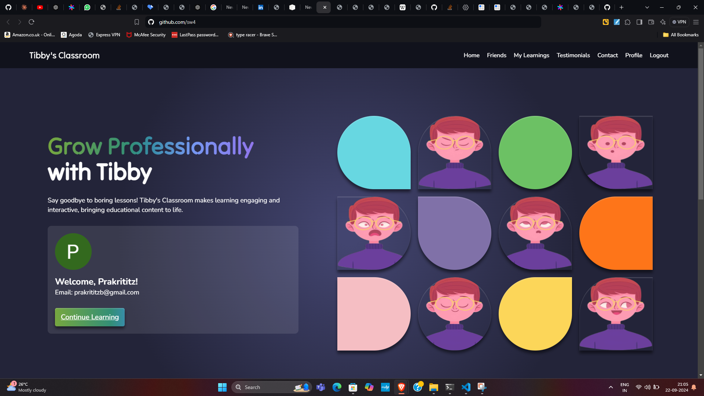

# Tibby's Classroom - Python + GEN AI Hackathon Submission

## Introduction

Welcome to Tibby's Classroom, a submission for the Python + GEN AI Hackathon! This project showcases the integration of a chatbot designed to enhance educational experiences by creating visual summaries, generating mind maps, quizzes, and summarizing PDFs based on user input.

Tibby's Classroom makes learning interactive and exciting by allowing students to engage with content through visual summaries, mind maps, and quizzes. The chatbot, Tibby, also adapts its expressions based on the images in the visual summaries, making the experience more dynamic and personalized.
## Features

- **Visual Summaries**: Enter a topic, and Tibby generates a visual summary complete with images. Tibby also adapts its expressions based on the image content to create a more engaging interaction.
  
- **PDF Summarization**: Upload a PDF file, and Tibby will extract key points and create concise summaries.
- **Quiz Generation**: Based on the input topic, Tibby creates quizzes to test knowledge and reinforce learning.
- **User-Friendly Interaction**: Tibby’s friendly persona and changing expressions make the learning process more engaging.
- **Gamification and Friends System**: Users can create accounts, track progress, and compete with friends on quizzes and topic mastery, similar to platforms like LeetCode. Progress tracking, leaderboards, and quiz scores foster a competitive learning environment that encourages engagement and collaboration.

## How Tibby Works

1. **Input**: The user provides a topic or uploads a PDF file.
2. **Processing**: Using Python and Gen AI, Tibby processes the input to generate a visual summary, mind map, or quiz. It can also summarize PDFs to extract essential information.
3. **Visual Output**: Tibby generates summaries with accompanying images, which are then displayed with an interactive chatbot interface. Tibby’s expression changes based on the image content to reflect the tone of the summary.
4. **Quiz Generation**: Tibby prepares a set of questions based on the topic, helping users self-test and solidify their understanding.

## Project Structure

```bash
Tibbys-Classroom/
│
├── src/                 # Source code
│   ├── chatbot.py       # Core chatbot functionality
│   ├── summary.py       # Module for generating visual summaries
│   ├── mindmap.py       # Mind map generation
│   ├── quiz.py          # Quiz generation based on the topic
│   └── pdf_summarizer.py# PDF summarization
│
├── static/              # Images, stylesheets, and static assets
├── templates/           # HTML files for the chatbot interface
├── README.md            # Project documentation (You are here!)
└── requirements.txt     # Required dependencies
```
## Installation
Clone the repository:
```bash
git clone https://github.com/your-username/tibbys-classroom.git
cd tibbys-classroom
```
Install the required dependencies:
```bash
pip install -r requirements.txt
```
Run the application:
```bash
python app.py
```
## Tech Stack
- **Python**: Core programming language
- **Gen AI**: Used for generating summaries, mind maps, and quizzes
- **Flask**: Backend framework to power the chatbot interface
- **HTML/CSS/JavaScript**: For creating the front-end and making Tibby's Classroom interactive
## Future Enhancements
- Adding multilingual support to expand Tibby’s reach to different language learners.
- Incorporating voice input/output to make Tibby more accessible.
- Enhancing the quiz system with different types of questions (multiple choice, true/false, etc.).
- AI-Powered Recommendations: Introducing personalized learning paths based on user progress and adaptability. Tibby will recommend topics and quizzes tailored to the learner’s strengths and weaknesses.
- World Ranking System: Maintaining a global leaderboard where users can track their rank and compete with learners worldwide.
- Enhancing the quiz system with different types of questions (multiple choice, true/false, numerical etc.).
- Broad Audience Reach: Tibby’s Classroom will expand to serve anyone interested in learning any topic, from students to professionals seeking to enhance their knowledge and skills.

## Team Memebers:
1. Prakrititz Borah  Prakrititz.Borah@iiitb.ac.in
2. Sriram Srikanth  Sriram.Srikanth@iiitb.ac.in
3. Unnath Chittimalla    Unnath.Chittimalla@iiitb.ac.in
4. Areen Patil  Areen.Patil@iiitb.ac.in

## Contributions
We welcome contributions! Feel free to fork the project and open a pull request for any improvements, bug fixes, or new features.

## License
This project is licensed under the MIT License. See the LICENSE file for more details.

## Contact
For any queries or feedback, please reach out via email to any of the team members.

Thank you for exploring Tibby's Classroom! Let’s make learning fun and interactive! 🌟

